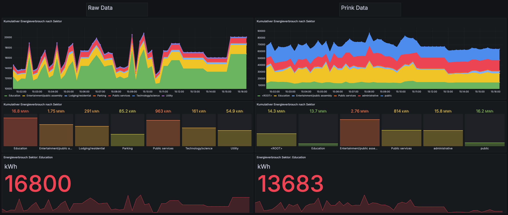

# PrinkBenchmarking
### Benchmarking Framework for Prink 


## Benchmark Configuration


### SUT - Prink

### Client - Load Generator

To start the client, cd into the client directory and run the following command:

```bash
go run main.go 
```

### Grafana Dashboard
- loicated at `http://localhost:3000`



### 🪧 Demo execution
- Run the client
````
cd client
go run main.go
````
- run grafana and victoria metrics
````
docker-compose up grafana -d
docker-compose up victoriametrics -d
```