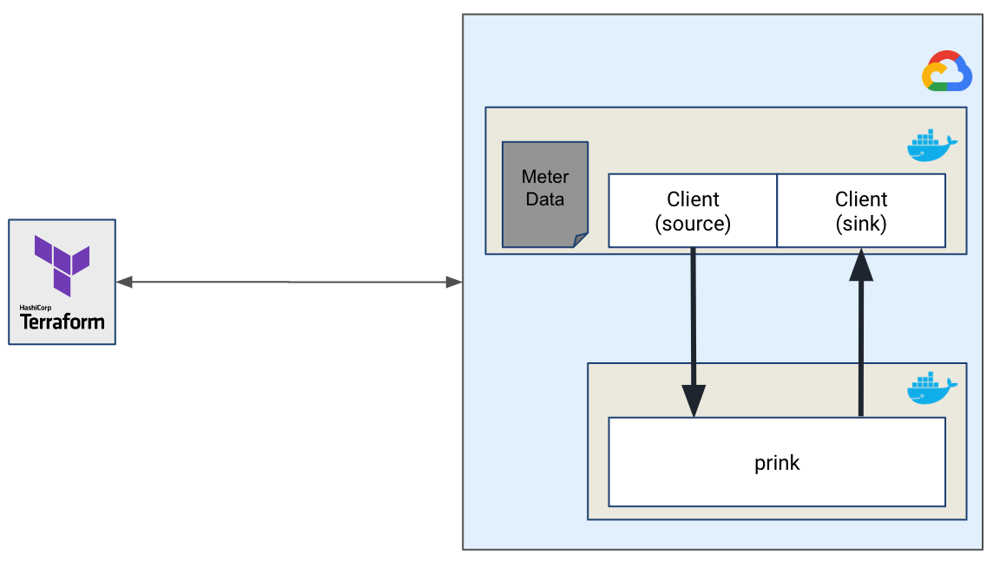

# PrinkBenchmarking
### Benchmarking Framework for Prink 



## Benchmark Configuration


### SUT - Prink

### Client - Load Generator

To start the client, cd into the client directory and run the following command:

```bash
go run main.go 
```